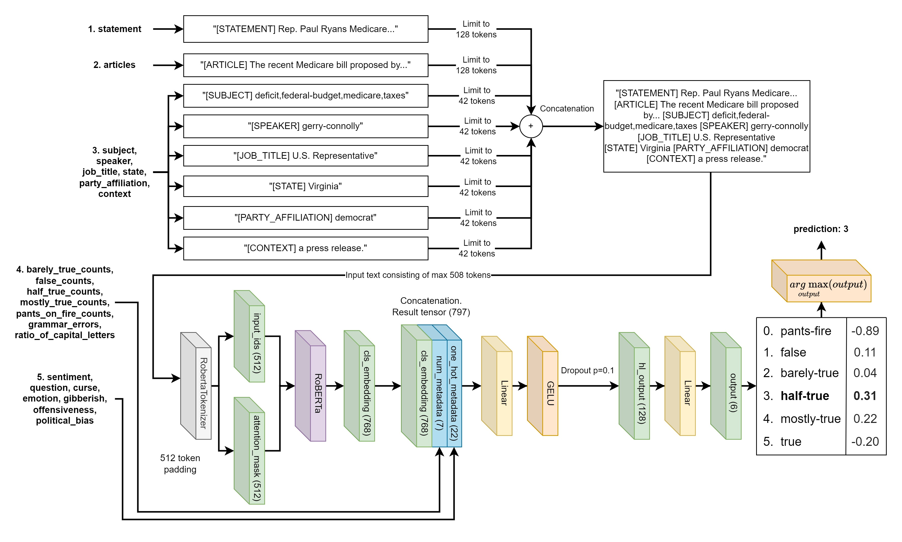

# Engineering Thesis

The project explores machine-learning approaches to classifying the truthfulness of text. It evaluates whether augmenting the input with automatically generated content can improve classification performance. The system uses a RoBERTa-based encoder, and the generated content consists of synthesized articles derived from the original input. The project also includes a demo application for testing and demonstrating the solution.

## Project Structure

The project's structure consists of two repositories and the thesis file:

- liar_plus_analysis - The cleanup, augmentation and analysis for LIAR PLUS dataset.
- thesis_classifier - The classifier, experiments, results and demo application code.
- Thesis.pdf - The engineering thesis document.

Due to the original academic context of the project, the thesis is in polish and some parts of the code in both repositories may contain names, as well as comments, in polish. Some files may be named in polish.

Please, navigate to downstream project repositories' README.md to learn the project structure and details.

## Used Technologies

This project uses: CUDA, DVC, Gradio, Jupyter Notebook, LanguageTool, MLFlow, Pandas, Paramiko, PyTorch, SQLite, TorchMetrics, scikit-learn.
